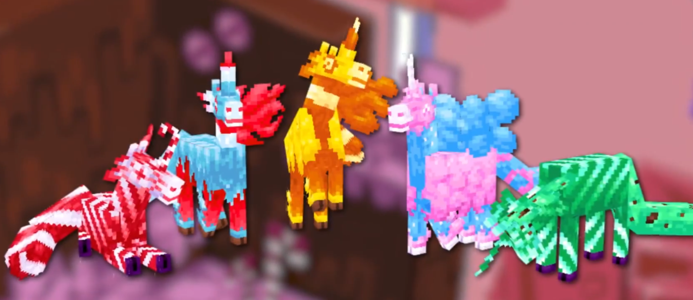

改动提交时间：2024年10月22日~23日

标星号*者为本人觉得仍有提升空间，但迫于时间而暂定的本地化文本。
> [!Tip]
> 使用`Ctrl`+`F`快速查找。
## 方块和物品
### Small/Large Peppermint
````diff
- "block.alexscaves.small_peppermint": "小型薄荷糖晶簇",
+ "block.alexscaves.small_peppermint": "小型薄荷糖",
- "block.alexscaves.large_peppermint": "大型薄荷糖晶簇",
+ "block.alexscaves.large_peppermint": "大型薄荷糖",
````
是失误，没得洗。缘由是提交翻译时模组尚未被编译，无从进游戏体验，只能依靠Blockbench查看一部分方块的模型，眼错不见这个就被跳过去了，之后也一直被忽略了。至于为什么是晶簇呢，译的时候把它和之前的硫磺晶簇（Sulfur Cluster）混淆了……

### Frostmint
````diff
- "block.alexscaves.frostmint": "薄荷糖块",
+ "block.alexscaves.frostmint": "冰雪薄荷糖",
- "item.alexscaves.frostmint_spear": "薄荷糖长矛",
+ "item.alexscaves.frostmint_spear": "冰雪薄荷糖长矛",
    ……(部分省略)
````
未能与Peppermint区分，已修正。由于初始不是一个完整的方块（实际是½格方块，类似原版台阶方块），去掉“块”。

### Conversion Crucible*
````diff
- "block.alexscaves.conversion_crucible": "糖果反应釜",
+ "block.alexscaves.conversion_crucible": "转换坩埚",
````
这个译名在一些模组介绍视频中产生了不满的弹幕，原译名是想对下界反应核（Nether Reactor Core）的大胆致敬，从结果看确实是太big胆了，故退回兜底用的“转换坩埚”译名，因为也确实没能想到更好的（用“甘埚”这种谐音大概会出现“译者是不是不识字”的局面）。

### Biome Treat
````diff
- "item.alexscaves.biome_treat": "生物群系糖果",
+ "item.alexscaves.biome_treat": "生物群系棒糖",
````
有人在即时通讯内提出被译为“糖果”的对应原文过多，故此处作差分处理。至于余下的糖果烤炉（Confection Oven）、糖果法杖（Sugar Stuff）、糖果独角兽（Candicorn，见下一章节），目前看它们还没有必须要做差分否则会产生混淆的。

## 生物
> [!Note]
> 默认省略对应的刷怪蛋与其他相关物品

### Gumbeeper*
```` diff
- "entity.alexscaves.gumbeeper": "口香糖苦力怕",
+ "entity.alexscaves.gumbeeper": "糖球苦力怕",
````
原译名未能体现出原文Gumb(all)+(Cr)eeper的双关，而“口香糖球苦力怕”会太长，目前对“口香”二字作省略处理。

### Candicorn*
````
 "entity.alexscaves.candicorn": "糖果独角兽",
````
估计会一直有人问怎么没译为玉米糖独角兽。由于此举可以预期将会涉及到“萝卜白菜各有所爱”的问题，这里仅记录支持改(+)或者不改(-)的论据：

1. (-)生物名可作为Candy+Unicorn的双关，(+)也可作为Candy Corn+Unicorn的双关；
2. (-)使用中文进行检索时，只有搜索“万圣节玉米糖”时才能找到代表Candy Corn的三角形玉米硬糖，否则更多的结果会是玉米糖软糖。(+)在有游戏内生物的形象支撑下，此问题可能不那么重要；
3. (-)游戏里可以自然生成5种不同颜色的Candicorn生物，所有颜色生成概率均等，且其他4种Candicorn并非玉米糖配色（见图片），由此更倾向于论据1是Candy+Unicorn的双关，而只在进度图标上同时玩了第二个双关；
4. (+)游戏里骑乘Candycorn生物时，物品栏上方用于表示充能槽的图标确实是一个万圣节玉米糖的形状。这个图标也用在了对应的进度上。



以上，在无更多支持修改的观点或一个绝对优势的观点提出前，此译名不做改动。